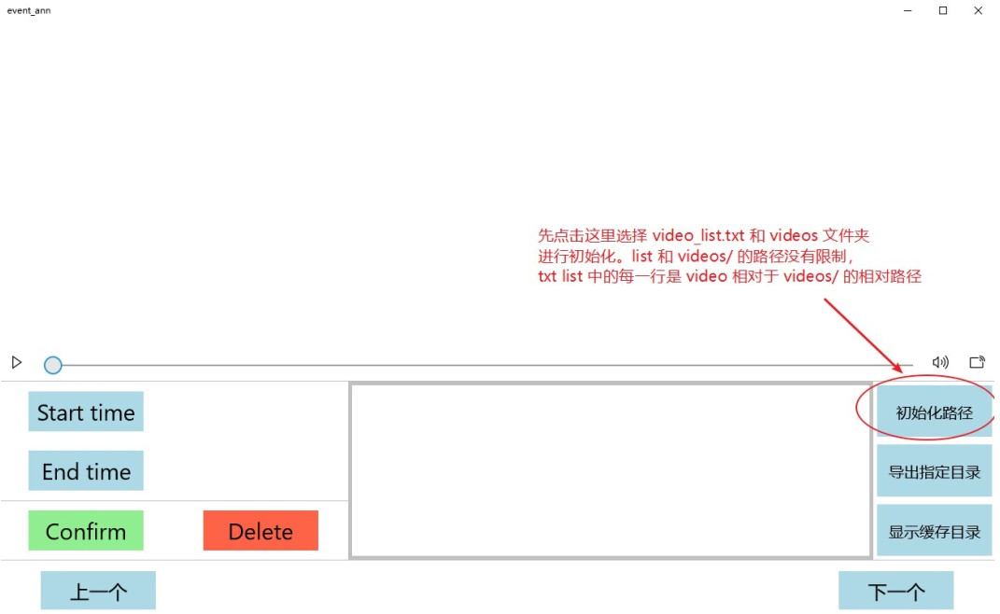
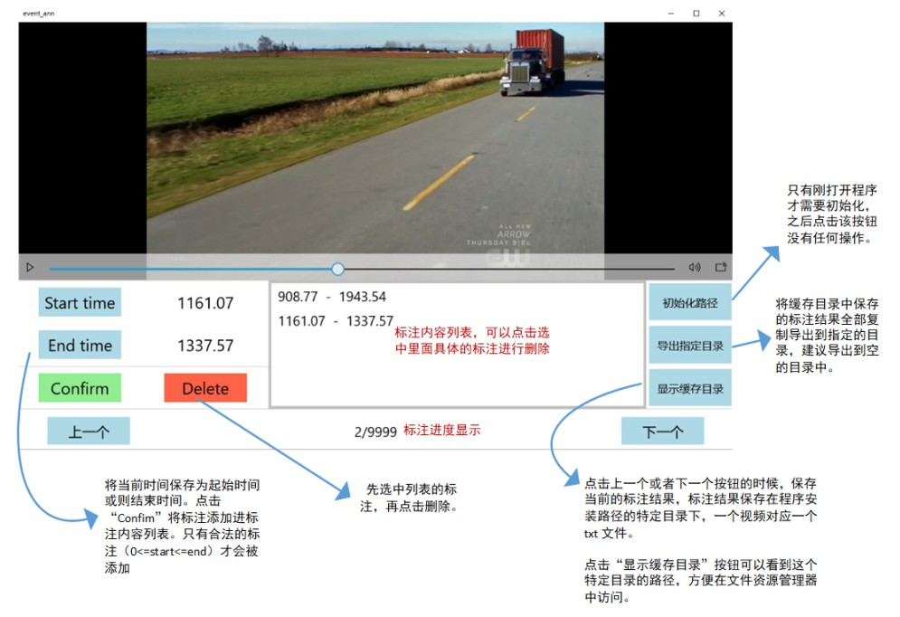

# **VideoEventAnnTool** (UWP)


A video annotation tool for video events in [Dense-Captioning Events in Videos](https://arxiv.org/abs/1705.00754). Only support labeling events with start and end timestamps.


> Develop in Visual Studio 2015.


## 1. Installation

1. Set Windows10 as `Developer Mode`.
2. Install the tool with `event_ann_${version}_x86.appxbundle` in the release directory or debug it in Visual Studio.

If you occur trusted certificate problem, run `Add-AppDevPackage.ps1`in the release directory to solve it.

```powershell
powershell -ExecutionPolicy ByPass -File .\Add-AppDevPackage.ps1
```


## 2. Usage 

### 2.1 Initialization

Select the video_list.txt and the correspond video directory to initial the application.



### 2.2 Basic Usage(in Chinese)




### 2.3 Hotkey

1. Ctrl-S: Press button `Start time`
2. Ctrl-E: Press button `End time`
3. Ctrl-D: Press button `Confirm`
4. Ctrl-F: Press button `下一个`

